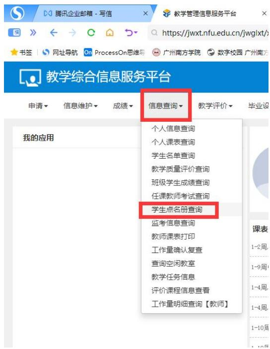
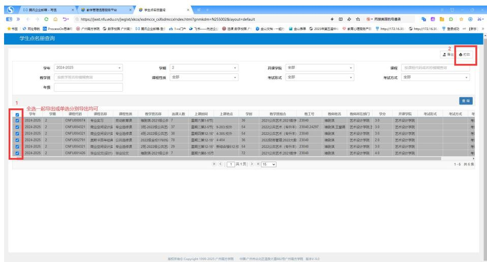
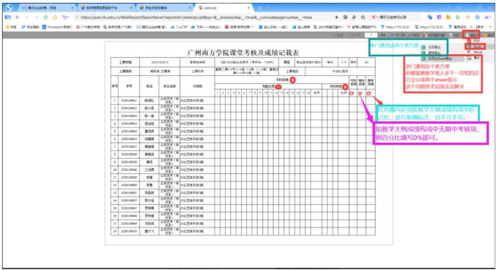
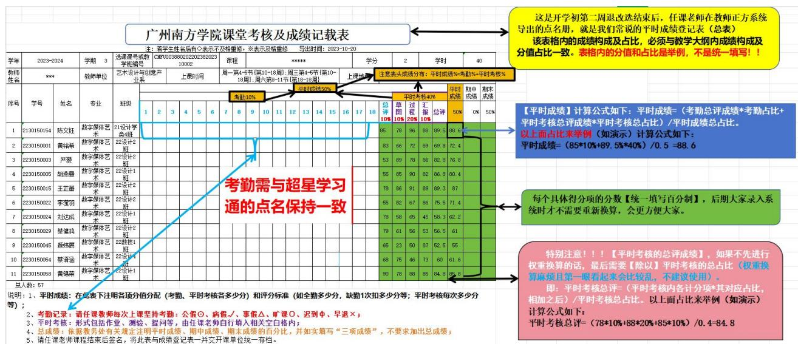

点 名 册 【 平 时 成 绩 登 记 表 】 导 出 途 径 ： 正 方 教 务 系 统

https://jwxt.nfu.edu.cn/jwglxt/xtgl/login_slogin.html--信息查询--学生

点名册查询-选中要导出的课程-打印-输出-选择对应导出格式

# 下面截图点击图片，右边放大镜可放大看

# 温馨提醒：

1、日常教学过程中，学生【超过2 次缺勤】，任课老师务必及时联系辅导员老师进行告知并请求协助。因为学生的缺勤可能还涉及到学生人身安全的责任归属。

同时，超过学校规定的缺勤次数，期末考核周前一周，任课老师需对此进行【取消课程考核资格】申请。

【及时处理更好】至少在学生未提交平时作业次数即将临界点而可能失去平时成绩或被取消课程考核资格时，请任课老师务必及时请求辅导员老师的协助，以便辅导员老师做学生帮扶或家校沟通，以免日后家长纠纷。

公共课如有此类情况，可以请我院负责课程管理的吴老师，协助对学生所在院系进行告知。

# 2、取消考核资格的条件及成绩处理

（一）学生一学期请假的时间累计达到当学期总天数三分之一的，应取消其当学期已选课程的考核资格；  
（二）学生一门课程请假或旷课的课时数累计达到该门课程总学时三分之一的，应取消该门课程的考核资格；

【老生老办法，老生（2025级之前）除上面两条外，还有第三条】 （三）学生欠交课程论文、课程作业、调查报告和实验报告等的次数累计达到该门课程要求提交的总次数的三分之一，或不及格的次数累计达到该门课程要 求提交的

总次数的二分之一的，应取消该门课程的考核资格，已参加考核的，成 绩可按无效记。

被取消考核资格的学生不能参加该门课程的期末考核，已参加考核的，成绩无效，任课教师应将其该门课程总评成绩记为 0 分并注明“取消考核资格”

# 一、点名册【平时成绩登记表】导出途径：

