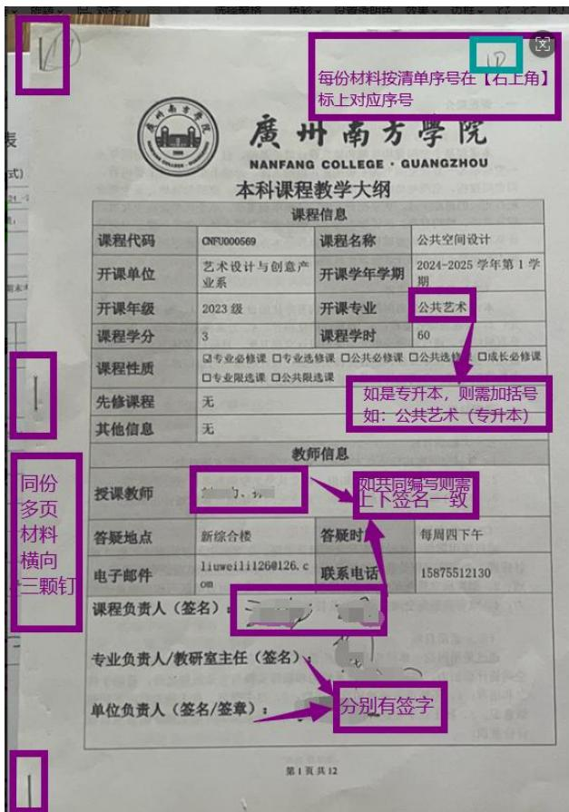
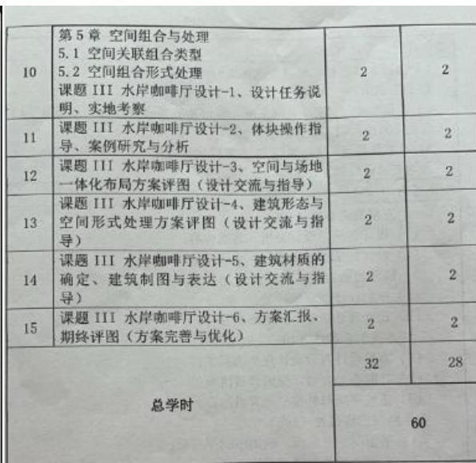
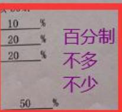
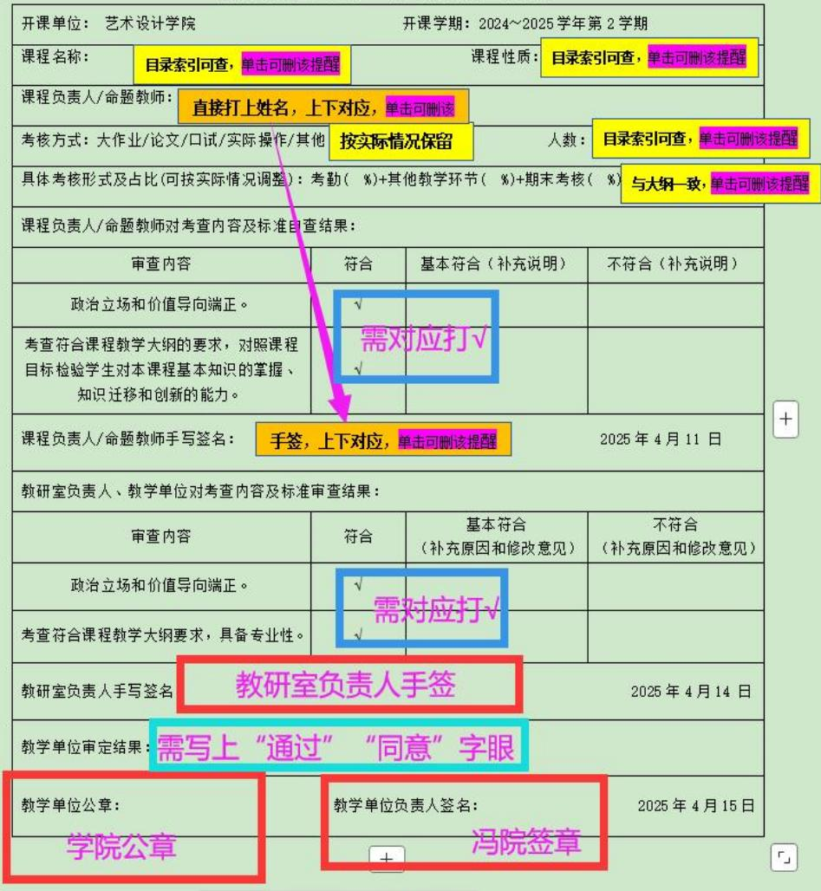
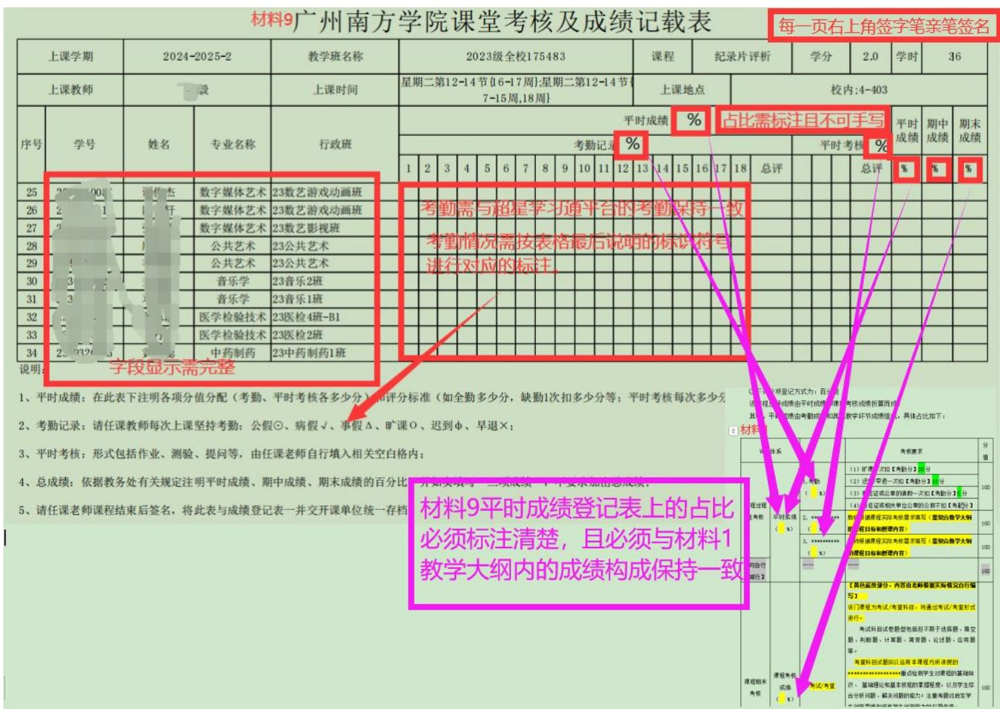
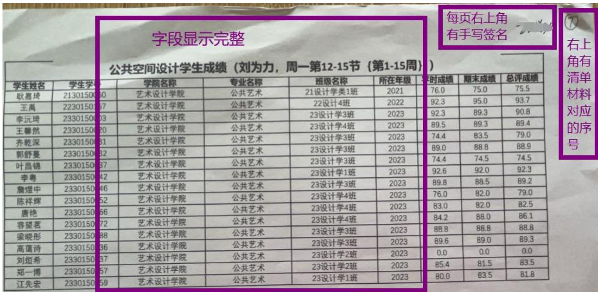
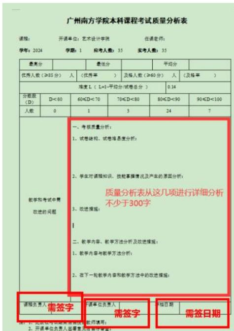

# 以下仅供试卷袋自查时参考使用，非官方非完美无误 （截图为旧版材料，只需关注提示点即可，不用去关注它的模板）

注：1、同一份多页材料是否有左侧三颗钉？留意AB卷不要装订在一起  
2、所有材料是否有按试卷袋封面清单在【右上角】标注对应序号？  
3、 归档清单材料是否齐全？  
4、试卷袋内所有材料 【是不是】本试卷袋教学班材料？  
5、试题 AB 卷、评分标准、自查表是否盖公章？AB 卷、评分标准留意同份材料多页需盖骑缝章。自查表不需盖骑缝章。  
6、下列截图，左击图片，右边放大镜可放大查看。

# 一、材料1：教学大纲

材料 1 封面课程相关信息是否为该试卷袋材料？授课教师如共同编写则上下签名【需一致】。如有课程组并且有课程组负责人，则上下签名可不一致。【是否有】涂抹或【缺】签名：最后一页的评分体系总占比【是否为百分制占比】（不多不少）。

六、评分体系与标准（评分项目不少于3项）出分体分体系（评分构成与分数占比）、评分标准及考核要求

（一）课程过程性考

1、出勒率：  
2、课程作业：  
3、课题作品：

1、课课题作品

# 二、材料 2：试题 AB 卷（AB 卷右上角分别盖公章，如同一份材料多页，则需盖骑缝章）

1、年级不可缩写——应写如：2021、2022、2023、2024；  
2、专业不可缩写，需与录取专业一致， 如专升本则需要加上括号（ ） 比如：数字媒体艺术（专升本）、公共艺术（专升本）、艺术设计学（专升本）、数字媒体技术（专升本）。专升本不是一个专业，而是一个层次，当体现出来的时候，需加括号加以识别。  
3、课程名称是否与培养方案一致，可使用目录索引或任课教师个人教务系统内课表进行核对；  
4、是否为 A 卷和 B 卷？不能是 AA 或 BB；A、B 卷考核内容不能相同，即，AB卷不能同卷。  
5、出题是否具有较强的可执行性和可操作性，内容是否过少。

大白话解读：必要的数据和资料须在试题中提供，必备的要素、格式要求需要明确出来，便于学生把握试题要求。试题一定是要让学生看到试题，就知道要做什么，怎么做才可能符合要求获得好的成绩。

6、卷面是否为百分制（不是百分比）

7、考查科目试题内要求学生提交的时间，我们为了方便老师，给与统一为：

2026 年 1 月 16 日（第 19 周周五）为截止提交时间。

如教师有个性化提交日期，则需与校历及上课周次最后一次课的日期进行匹配，确保要求学生提交的时间不可占用正常授课学时。

# 三、材料 3：评分标准（右上角盖公章，如同一份材料多页，则需盖骑缝章）

1、表头信息是否有误（自查参考上面材料2 第1,2,3点）；  
2、评分标准是否同质化、是否过于笼统、是否有具体采分点，是否具有较强的可执行性及操作性；

大白话解读：让学生或者专家一看，就知道学生哪些不符合采分点而不得分，哪些

非常符合得分点而高分。

3、上下分值是否一致；

4、是否有参考示例；

5、总分值是否为百分制（100分）；

6、是否用了百分制——（不是百分比）；

7、考查科目如 AB 卷评分标准不一样的，则需跟考试科目一样，分开 AB 卷出评分标准。考查科目如 AB 卷评分标准可通用，则只需要一份自查表即可。

# 四、材料 4：自查表（单位审核结果处需盖公章，不需盖骑缝章）

1、表头信息是否有误——（自查参考上面材料2第1,2,3点）；  
2、课程性质是否有误——目录索引或教师个人课表可获取；  
3、课程负责人/命题教师上下是否一致？表头上的课程负责人/命题教师电脑打上去，下面的审查确认签字则需手签。此时需留意，如同一门课程多个教学班多位任课老师使用同一套教学大纲，则原则上需要共同出卷（即统一命题），此时，自查表内课程负责人/命题教师两栏（电脑打及手签）处需同时体现出共同出卷的教师姓名；

4、自查表日期为了方便老师们，我们统一为

前十周结课课程：2025 年 10 月 24 日（第 7 周周五）

后十周结课课程：2025 年 12 月 12 日（第 14 周周五）

。如任课教师进行个性化填写，则需与试题AB 卷内要求学生提交的时间进行对比，确保自查表时间是在试题启用之前的逻辑，即自查试题无问题才可以启用试题；

5、自查表需要有课程负责人手签、教研室负责人手签、开课单位审定结果“通过”“符合 ”“同意”等字样均可，且有公章及签章；

6、自查表内的自查内容、评分标准自查，是否有逐项自查；  
7、自查表的自查内容中，提交时间是否与材料2的提交时间一致；  
8、自查表内的评分标准自查是否与材料3的评分标准中的评分项分值一致；  
8、考查科目如AB 卷评分标准不一样的，则需跟考试科目一样，分开AB 卷出自查表。

# 广州南方学院期末考查自查表

（适用于大作业、论文、口试、实际操作等考核方式）

# 五、材料 5：期末考查大作业 （电子版提交的科目，储存媒介为各系移动硬盘和网盘双渠道储存，且需加【广州南方学院期末考查阅卷打分表】或【评语表+封面】；如纸质版提交的科目，则答卷直接放置试卷袋内即可）

1、课程考查生成文字类考核材料的（如论文、大作业、报告等），纸质版答卷阅卷要求参照上述考试阅卷规范执行，电子版答卷由阅卷教师在尾页依次附上总结评语、得分、电子签名，并将文件转为 PDF 文件存档（详见附件：【考查科目阅卷规范】文字类考核材料封面模板、【考查科目阅卷规范】文字类考核材料的评语表。  
2、课程考查生成实物类作品、考查方式为实操类或演示类的，按照过往自制的【广州南方学院期末考查阅卷打分表】继续使用。留意！！需有具体采分点！！

# 广州南方学院

# NANFANG COLLEGE·GUANGZHOU

# 《xXXX》课程作业

学院设计学院

专

学

任课老师

师总结评话：

（200-300字）

得分：

教师签名：（可用电子签）

日期：年月日

# 【考查科目阅卷规范】 -期末考查阅卷打分表

# （适用于实操类、演示类、实物作

# 品等 （左击图片右边放大镜可放大）：

广州南方学院期末考查阅卷打分表  

<table><tr><td rowspan="2">学年教师</td><td></td><td colspan="2">学期</td><td>选修课或教学班级编号</td><td colspan="3"></td><td>课程</td><td colspan="5"></td><td>学分</td><td></td><td>学时</td><td></td><td></td><td></td><td></td></tr><tr><td colspan="2"></td><td>教师单位</td><td colspan="2"></td><td>上课时间</td><td colspan="6"></td><td>上课地点</td><td colspan="4"></td><td></td><td></td><td></td></tr><tr><td rowspan="3">序号</td><td rowspan="3">学号</td><td rowspan="3">姓名</td><td rowspan="3">专业</td><td rowspan="3">班级</td><td rowspan="3">一、文本完整性(40分)</td><td colspan="4">二、排版精美、版面整洁、视觉表达清晰(10分)</td><td colspan="5">三、汇报内容语言流畅、逻辑清晰、精神面貌好(10分)</td><td colspan="3">四、观点新颖、方案有创意、有想象力,又有一定的可行性(10分)</td><td>总评</td><td>语评</td><td></td></tr><tr><td rowspan="2">(1) 教师准确、资料详实、调查方法科学</td><td rowspan="2">(2) 表情、图片、物质性好</td><td rowspan="2">(3) 语言表达、结构特点、知识性较强、能体现艺术美感</td><td rowspan="2">(2) 示意图、视觉性好、能体现艺术美感</td><td rowspan="2">(3) 内容、结构设计独特、作品独到</td><td rowspan="2">(1) 道德、思想有条理</td><td rowspan="2">(2) 方案层次递进,能很好的记录使用本课程的一些分类方法</td><td rowspan="2">(3) 思维性与单一性、整体性与协调性等相同的一致的，系列作品前后及图连贯</td><td rowspan="2">(4) 正确运用平衡、统一、对比、连续等各种美的形式法则</td><td rowspan="2">(5) 作品反映出作者一定审慎和审慎能力</td><td rowspan="2">(1) 章点强</td><td rowspan="2">(2) 方案有创新力</td><td rowspan="2">(3) 设计思维、细节意识在合理使用审美规律的基础上设计有可行性</td><td rowspan="2">评分</td><td>评语</td></tr><tr><td></td></tr><tr><td>1</td><td>2030118001</td><td>刘爱玲</td><td>艺术设计学(专升本)</td><td>20级艺术设计学专升本1班</td><td colspan="12"></td><td>与期</td><td></td><td></td><td></td></tr><tr><td>2</td><td>2030118006</td><td>王文凯</td><td>艺术设计学(专升本)</td><td>20级艺术设计学专升本1班</td><td colspan="3"></td><td colspan="8">这部分评分标准及占比来自试题AB卷编写时的评分标准及占比。按采分点打分。</td><td></td><td>未成绩保持一致</td><td></td><td></td><td></td></tr><tr><td>3</td><td>2030118010</td><td>李淑茹</td><td>艺术设计学(专升本)</td><td>20级艺术设计学专升本1班</td><td colspan="3"></td><td colspan="8"></td><td></td><td></td><td></td><td></td><td></td></tr><tr><td>4</td><td>2030118014</td><td>辛雁轩</td><td>艺术设计学(专升本)</td><td>20级艺术设计学专升本1班</td><td colspan="3"></td><td colspan="8"></td><td></td><td></td><td></td><td></td><td></td></tr><tr><td>5</td><td>2030118016</td><td>胡景</td><td>艺术设计学(专升本)</td><td>20级艺术设计学专升本1班</td><td></td><td colspan="12">根据《广州南方学院2023-2024学年第—学期课程考核材料阅卷规范》【附件1：广州南方学院2023-2024学年第—学期课程考核材料阅卷规范.doc】请各位有考查课程的任课老师特别留意该附件内第二大项，按要求执行。该表为实物类作品、考查方式为实操类或演示类的阅卷规范要求模板，供大家参考使用。</td><td></td><td></td><td></td></tr><tr><td>6</td><td>2030118023</td><td>谢琪</td><td>艺术设计学(专升本)</td><td>20级艺术设计学专升本1班</td><td></td><td colspan="11"></td><td></td><td></td><td></td><td></td></tr></table>

总人数：28  
备注（实际制作时进行删除）：  
1、课程考查生成实物类作品、考查方式为实操类或演示类的，阅卷教师须根据考核题目、评分标准完成阅卷工作，成绩应登记在相应的电子表格中，表格应记录每名学生的具体得分点，并附上教师电子签名，并转为PDF文件存档。实物类作品应采用视额、照片等方式与成绩记录表格一同保存。  
2、评分标准，评分分值必氢与对应学年学期的用券（试题A或B券）保持一致。

# 该份表格使用教师个人教务系统内【点名册】进行格式调整和文字编写即可直接套用。表头课程基础信息直接使用即可

# （二）考试阅卷工作的要求

1.教师在阅卷时应提前认真学习参考答案、评分标准，必公平公正的原则，严格按照试卷的参考答案和评分标准批阅不偏宽、不偏严。

2.阅卷一律用红色字迹的笔批阅试卷；签名处一律用黑色3.试卷评阅只允许使用6种评阅符号： “”、“X”

双横线。答题正确的使用“”标记；答题错误的使用“X”用半对标记，并在错误处用下划线标出；答题不完整或整题未加注省略号。

4.试卷记分必须使用阿拉伯数字，要求准确、工整、清评卷时答卷错误处使用扣分，扣分标注在该小题的右侧，该魔

5.试卷中涉及的简答题、论述题、材料分析题、开放性主分标准中的解答步骤或具体得分点逐项评分，不得只给总分可以总结评语的形式说明得分原因，不得只给总分。

6.分数一经评定，不得随意更改，若因误评或漏评确需更处标注双横线并签全名

7.阅卷教师须在整册答卷的“教师签名”处签全名8.所有试卷需签名处必须由阅卷教师本人亲笔签名， 亚二、考查阅卷规范

1.课程考查生成文字类考核材料的（如论文、大作业、要求参照上述考试阅卷规范执行，电子版答卷由阅卷教师在局分、电子签名，并将文件转为PDF文件存档。

课程考查生成实物类作品、考查方式为实操类或演示题目，评分标准完成购卷干作成绩应登记在长应的中子素生的具体得分点，并时上教师电子签多，并转为PDE文件存机

# 3、是否有期末考查大作业？

是否有期末考查阅卷打分表或评语表（右上角签名且为PDF格式）？

考查大作业份数，是否与成绩人数对应得上？

# 六、材料6：平时成绩登记表

1、是否有打上占比？  
2、不可手写占比；  
3、占比是否与材料 1 教学大纲最后一页的评分体系的占比和分值一致？  
4、是否有考勤记录？考勤记录是否与学习通一致？  
5、不可反向打印；  
6、每一面右上角都需手写签名；  
7、纸面信息是否显示完整？

# 七、材料7：期末成绩单

1、纸面信息是否显示完整？  
2、每一面右上角都需手写签名；  
3、不可反向打印；

# 八、材料 8：质量分析表存档日期统一为：2026 年 1 月 23 日（第 20 周周五）

1、是否有分点详细分析？  
2、是否字数过少？（300-400字为宜）  
3、是否有签名？

