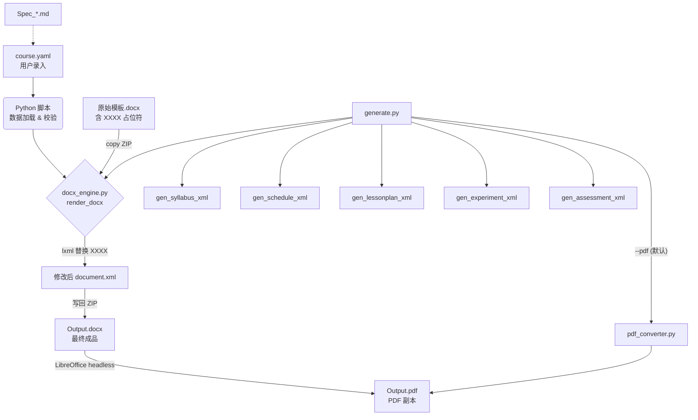

# 架构设计说明 (Architecture)

## 1. 设计理念：领域驱动 (Domain Driven)
本项目按照 **"输出成果"** (Output Domain) 进行模块化封装。每个模块都是一个独立的 **"生成器包 (Generator Package)"**。

### 为什么这样做？
*   **高内聚**：修改"大纲"相关内容时，只需关注 `01_Syllabus_Generator`，无需在多个文件夹间跳转。
*   **可扩展**：添加新的文档类型（如"毕业设计指导书"），只需复制一个文件夹并修改即可。
*   **清晰的边界**：每个包定义了自己的输入（Schema）、规则（Spec）和输出（Template）。

## 2. 生成器包结构
每个 Generator 文件夹（如 `01_Syllabus_Generator`）包含以下核心组件：

### 2.1 规范文档 (`Spec_*.md`)
*   **作用**：人读的指南。
*   **内容**：从学校教务处发布的总指南中提取的、仅与该文档相关的规则。
*   **示例**：`Spec_Syllabus.md` 包含关于 OBE 目标撰写、学时分配、课程性质分类的具体要求。

### 2.2 原始模板 (`*.docx`)
*   **作用**：格式的 **单一事实来源 (SSOT)**。
*   **约定**：模板中所有需要替换的动态内容使用 `XXXX` 占位符标记。
*   **格式保证**：生成代码通过深克隆模板 XML 元素，100% 继承原始格式（字体/字号/行距/合并等），代码不构造任何格式属性。
*   **修改格式 = 修改模板**：如需调整输出格式，直接在 Word 中修改模板并保存即可。

### 2.3 数据模式 (`Schema`)
*   **Code as Schema**: 使用 Pydantic (`scripts/course_schema.py`) 作为单一事实来源。
*   **Nested Model**: Schema 2.5 采用深层嵌套结构，含 `objectives[].mappings[]` 数组格式、`excluded_weeks`、`session_time_overrides`、`classes[].archive_id`（班级归档序号，每学期由系部汇总表分配）等扩展。
*   **Executable**: Schema 不仅是文档，更是可执行的代码，用于 `audit_course_data.py` 校验数据完整性和人培交叉合规性。

### 2.4 核心逻辑 (`scripts/`)
*   **Main Entry** (`generate.py`): 主控脚本，调用各生成器模块。支持 `--pdf`/`--no-pdf` 开关控制双格式输出。
*   **Shared Engine** (`docx_engine.py`): 通用 XML 操作引擎（~830 行），提供 `render_docx` 入口、`clone_table_row`、`replace_xxxx`、`merge_runs`、`merge_docx_files`、`archive_filename`（归档命名）等公共 API。
*   **PDF Converter** (`pdf_converter.py`): LibreOffice headless PDF 转换工具，提供 `convert_to_pdf`（单文件）和 `batch_convert_to_pdf`（批量），带 5 次指数退避重试和 60s 超时保护。
*   **Syllabus Engine** (`gen_syllabus_xml.py`): 大纲引擎，已重构为调用 `docx_engine`。
*   **Schedule Engine** (`gen_schedule_xml.py`): 进度表引擎 — 表头填充 + 行动态增删（根据 `week_range` 自动调整行数，不再固定 18 行）。
*   **LessonPlan Engine** (`gen_lessonplan_xml.py`): 教案引擎 — 分周生成 + 合并版，支持 `excluded_weeks`、`session_time_overrides`。R2 授课时间根据 `week_range` 将 calendar 序号映射为各班级实际教学周次，并通过 `schedule_segments` 查询分段排课节次；节次缩减时自动追加压缩说明。时间输出为双单位消歧格式 `约{minutes}分钟（{hours_equiv}理论/实践学时）`，采用末项补正策略确保各 step 逐项学时之和精确等于声明 `hours_theory`/`hours_practice`。Gate 机制（W1 禁复习 / stage-学时偏差 / 总分钟一致性）硬性拦截不合规数据。
*   **Experiment Engine** (`gen_experiment_xml.py`): 实验材料引擎 — 3 模板 (Report/Recognition/Guide)，每实验 1 份。报告封面日期从 `calendar[].exp_id` 查找实验对应周次，通过 `week_range` + `excluded_weeks` 映射为班级实际教学周日期。
*   **Assessment Engine** (`gen_assessment_xml.py`): 考核材料引擎 — 6 模板 (Checklist/Paper/Criteria × A/B)。
*   **Date Core** (`utils/semester_utils.py`): 内置 `HolidayManager`，自动处理学期日期推算与法定节假日排除。

## 3. 数据流向

## 4. 目录映射
|生成器包|输出成果|脚本|模板数|关键依赖数据|
|---|---|---|---|---|
| `01_Syllabus_Generator`|课程教学大纲|`gen_syllabus_xml.py`|1|`course`, `objectives`, `calendar`, `assessment_methods`, `exams`|
| `02_Schedule_Generator`|教学进度表|`gen_schedule_xml.py`|1 (XXXX)|`calendar` + `semester_config` + `excluded_weeks`|
| `03_LessonPlan_Generator`|教案|`gen_lessonplan_xml.py`|1 (XXXX)|`calendar.lessons` + `week_range` + `schedule_segments` + `excluded_weeks`|
| `04_Experiment_Generator`|实验材料|`gen_experiment_xml.py`|3|`experiments` + `calendar.exp_id` + `week_range` + `excluded_weeks`|
|`05_Assessment_Generator`|试卷/评分/自查表|`gen_assessment_xml.py`|6|`assessment_methods`, `exams`|
|`06_Presentation_Generator`|PPT 课件|❌ 未实现|2|`calendar` (lessons)|

## 5. 已知陷阱与经验教训

> 以下经验来自 01_Syllabus 重建 + 02~05 全流程迁移 (2026-02)。

### 5.1 格式类
| 陷阱 | 根因 | 解决方案 |
|------|------|---------|
| vMerge 丢失 | `docxtpl` 渲染时破坏 Word 垂直合并属性 | 弃用 docxtpl，采用 XML 直接操作 |
| docxcompose 合并崩溃 | docxcompose 不重映射 `w14:paraId` 且保留源文档关联的 comments 等扩展，导致模板复用时的 ID 冲突与孤立引用报错 (Unreadable Content) | 合并前必须对所有源文件执行预清理（剥离所有 comments 相关 XML 并全量重新随机化 `w14:paraId`/`textId`） |
| 粗体继承错误 | 从模板第一段（bold）提取 rPr 作为所有段落的格式 | 方案②：分段克隆，每种段落类型使用对应模板 |
| numPr 序号重复 | Word 自动编号(numPr) + 代码手动序号同时存在 | 代码不写序号，保留段落原有 numPr 自动编号 |
| 段落格式偏差 | 程序化构造的段落缺少 spacing/indent 属性 | 深克隆原始 XML 元素，不手动构造任何 pPr |
| `.doc` 不兼容 | XML 引擎无法处理旧 `.doc` 格式 | 用 `textutil -convert docx` 预转换 |
| VML 图片 PDF 变形 | 模板 logo 使用 VML `v:shape` 嵌入（含负裁剪参数），LibreOffice headless 忽略 VML 负裁剪导致 logo 被压扁约 10% | 将 VML 替换为 DrawingML (`wp:inline` + `pic:pic`)，并修正宽高比为原始图片比例 4.343:1。已修复 4 个模板（`Syllabus.docx`、`Template_Schedule.docx`、`Template_LessonPlan_Cover.docx`、`设计学院模版-附件3：课程教案模板.docx`）。(2026-02-28) |

### 5.2 数据类
| 陷阱 | 说明 | 解决方案 |
|------|------|---------|
| 课程性质不匹配 | 代码分类与教务规范不一致 | 规范 5 类：专业必修/选修、公共必修/选修、成长必修 |
| 模板硬编码 | 模板含具体值而非 XXXX | 所有动态内容必须用 XXXX，修改模板 |
| XXXX 跨 run 分裂 | Word 将 `XXXX` 拆分到多个 `<w:r>` | 替换前先调用 `_merge_runs()` 合并 |
| Schema 异构 | 不同课程的 `course.yaml` 字段差异大 | 用 `.get()` 链式取值 + 类型检查，缺失字段优雅跳过 |
| `semester_config` 缺失 | 非标准课程无此字段导致 KeyError | 改用 `data.get('semester_config', {})` |
| **stage-学时偏差静默通过** | Gate 阈值 >2h、审计 TOLERANCE 30% 太宽松，1h 偏差（30min/周缺失）全部静默通过 | 阈值收紧为 >0.5h WARN、>1h CRITICAL/BLOCK；**生成器层用末项补正策略**确保逐项学时之和精确等于声明学时（数学恒等）|

### 5.3 流程与跨 Agent 协作 (Cross-Agent Sync)
| 陷阱 | 说明 | 解决方案 |
|------|------|---------|
| 跨区篡改 | A Agent 直接去改 B Agent 项目里的文件以适应自己的工具 | **严格身份隔离**：每个 Agent 只能修改自己工作区。跨区任务必须写交接文档 (`MSG_*.md`) |
| 暴力解引用(SSOT) | 解决班级进度差异时，直接把 `calendar` 复制全量第二份甚至加假造空节 | 引入 `classes[].excluded_weeks` / `week_range` / `session_time_overrides`，让生成器代码适配多态，坚守单源原则 |
| 隐式改Schema（双向） | ① YAML 加了字段但生成器不认识；② 生成器开始用新字段但 Schema 未声明（`extra='allow'` 掩盖遗漏）| 走完整生命周期：`course_schema.py` → `Spec_Global.md` / `Data_Dictionary.md` → 生成器 fallback 逻辑。**三层原子同步，同一会话完成** (2026-02-27) |
| 散乱文档 | 多份重复/过时指南增加混乱 | 归档旧文档，SSOT 仅保留 `Spec_*.md` 和 `docs/` 内容 |
| 模板 ≠ 样本 | 模板实为已填入内容的样本，干扰占位符正则 | 必须清理成纯 `XXXX` 的空白骨架（如 `XXXX_01`） |
| **解析耦合** | 生成器硬编码 `第{ch_idx}章 {topic}` 和 `{ch_idx}.{ci_num} {content}`，导致大纲/教案/进度表的章节编号格式不一致 | **WYSIWYG 原则**：生成器禁止自动编号。课程端在 YAML 直接写入带编号的完整文本，生成器原样输出。(2026-02-27) |
| **Spec 本身可能有误** | `Spec_Schedule.md §2.3` 曾误定义 `课堂教学 = theory + practice`（合计），实际应为 `课堂教学 = theory`（仅理论学时） | **先查 Spec 再行动**，但 Spec 与教务实际规范不符时应先修正 Spec。(2026-02-27 V3 修正) |
| **消息散落** | 跨 Agent MSG/RFC 分散在两端各自 `docs/` 下，无统一索引，新 Agent 无法快速了解待办状态 | **共享邮箱**：`/Users/yamlam/Downloads/cross_agent_mailbox/` 提供统一 `INDEX.md`、`active/` → `resolved/` 生命周期管理、标准 frontmatter（id/from/to/status/priority）。两端 `/mailbox_in` + `/mailbox_out` 工作流按 `to` 字段过滤确保身份隔离。(2026-02-27) |
